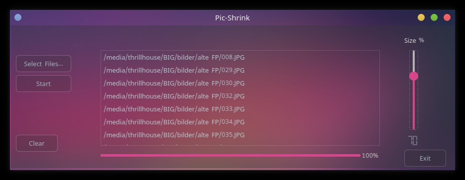

# Pic-Shrink
Little application that will shrink a list of given jpg files to a desired size, set by user. It's made with Python and PyQt5

1. Select jpg files in FileDialog

2. Adjust shrinking rate with slider

3. Click start, choose destination folder and watch the magic happen :)

Dependencies: PIL, PyQt5

Just clone, install deps with "pip install" and run pic_shrink.py 
